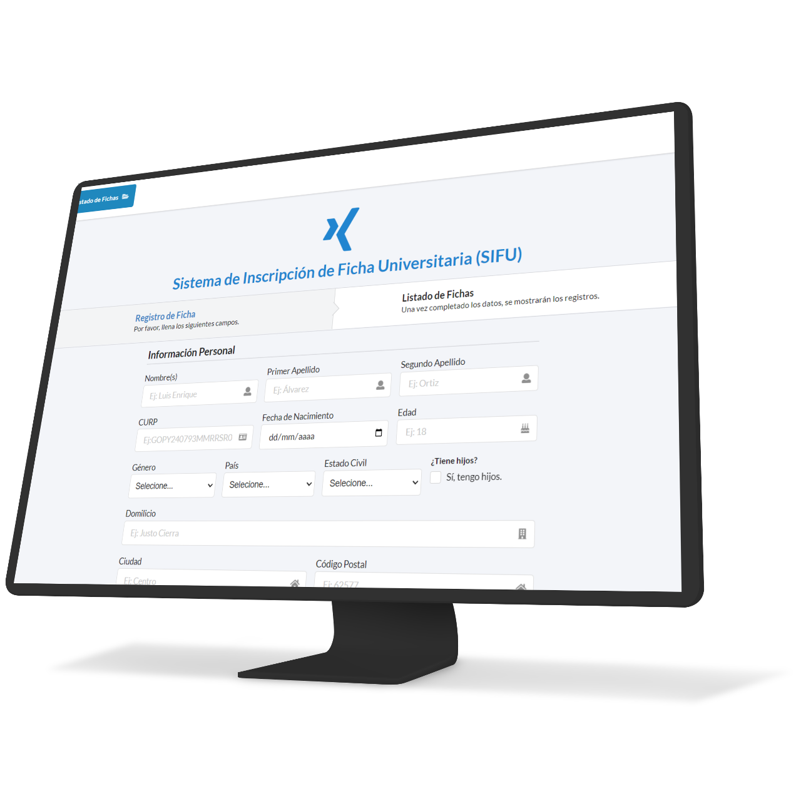

[![Contributors][contributors-shield]][contributors-url]
[![Forks][forks-shield]][forks-url]
[![Stargazers][stars-shield]][stars-url]
[![Issues][issues-shield]][issues-url]
[![MIT License][license-shield]][license-url]

<h1 align="center">
  <a href="https://github.com/ThePandaDevs/sifu"></a>
<br/>
  SIFU
</h1>
<h3 align="center">Sistema de Inscripción de Ficha Universitaria </h3>

<p align="center">
  <a href="#">Features</a> •
  <a href="#">How To Use</a> •
  <a href="#">Tools</a> •
  <a href="#">Support</a> •
  <a href="#">License</a>
</p>



## Features

* Form validations
  - Number inputs
  - Text inputs
  - Select inputs
  - Calendar input
  - Email input
  - Tel input

## How To Use

To clone and run this application, you'll need [Git](https://git-scm.com) and [JDK 11](https://www.oracle.com/mx/java/technologies/javase/jdk11-archive-downloads.html):

```bash
# Clone this repository
$ git clone https://github.com/ThePandaDevs/sifu.git

# Go into the repository
$ cd sifu

# Run the app with Java Spring boot
```

## Tools

This software uses the following dependencies:

- Spring 2.6.3
  - Thymeleaf
  - JPA
  - Validations
  - Spring web
  - Spring security
  - Spring boot devtools
  - Lombok
  - MySQL Driver
- MySQL 8.0
- Framework Semantic UI 2.4.2


## Support

<p>You can help us, sharing our projects </p>


## License

MIT

---

[contributors-shield]: https://img.shields.io/github/contributors/ThePandaDevs/sifu.svg?style=for-the-badge
[contributors-url]: https://github.com/ThePandaDevs/sifu/graphs/contributors
[forks-shield]: https://img.shields.io/github/forks/ThePandaDevs/sifu.svg?style=for-the-badge
[forks-url]: https://github.com/ThePandaDevs/sifu/network/members
[stars-shield]: https://img.shields.io/github/stars/ThePandaDevs/sifu.svg?style=for-the-badge
[stars-url]: https://github.com/ThePandaDevs/sifu/stargazers
[issues-shield]: https://img.shields.io/github/issues/ThePandaDevs/sifu.svg?style=for-the-badge
[issues-url]: https://github.com/ThePandaDevs/sifu/issues
[license-shield]: https://img.shields.io/github/license/ThePandaDevs/sifu.svg?style=for-the-badge
[license-url]: https://github.com/ThePandaDevs/sifu/blob/master/LICENSE.txt
